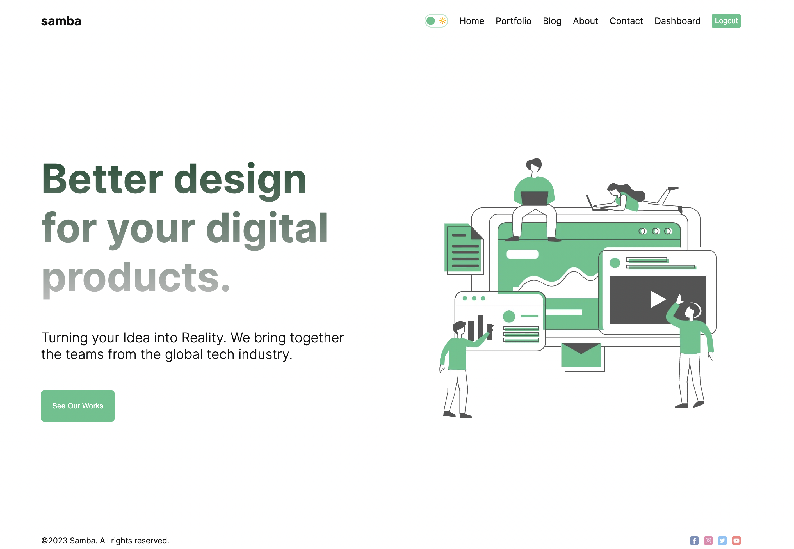
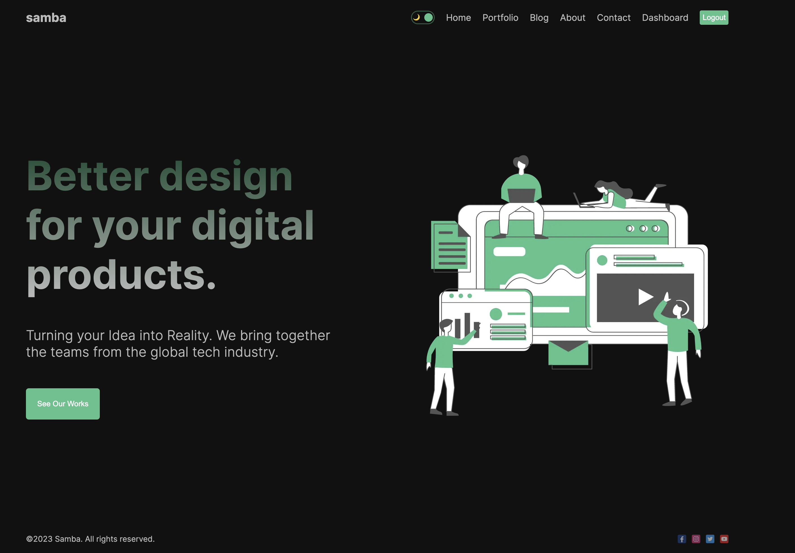
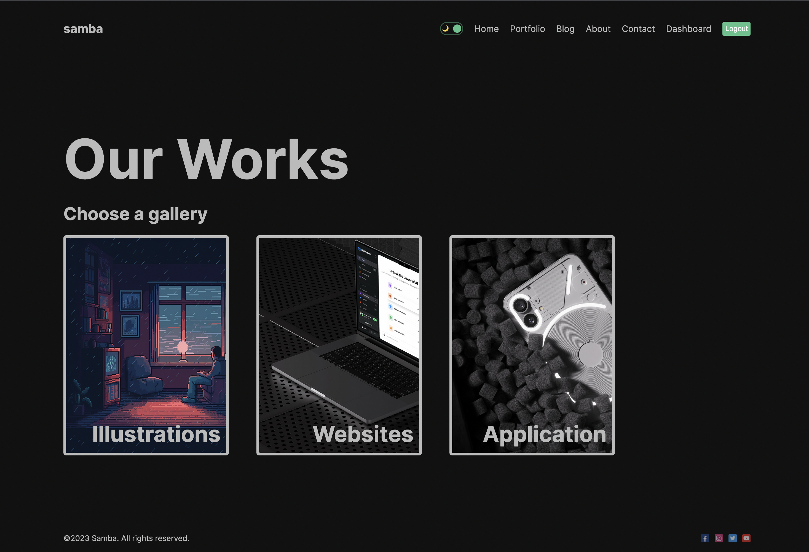
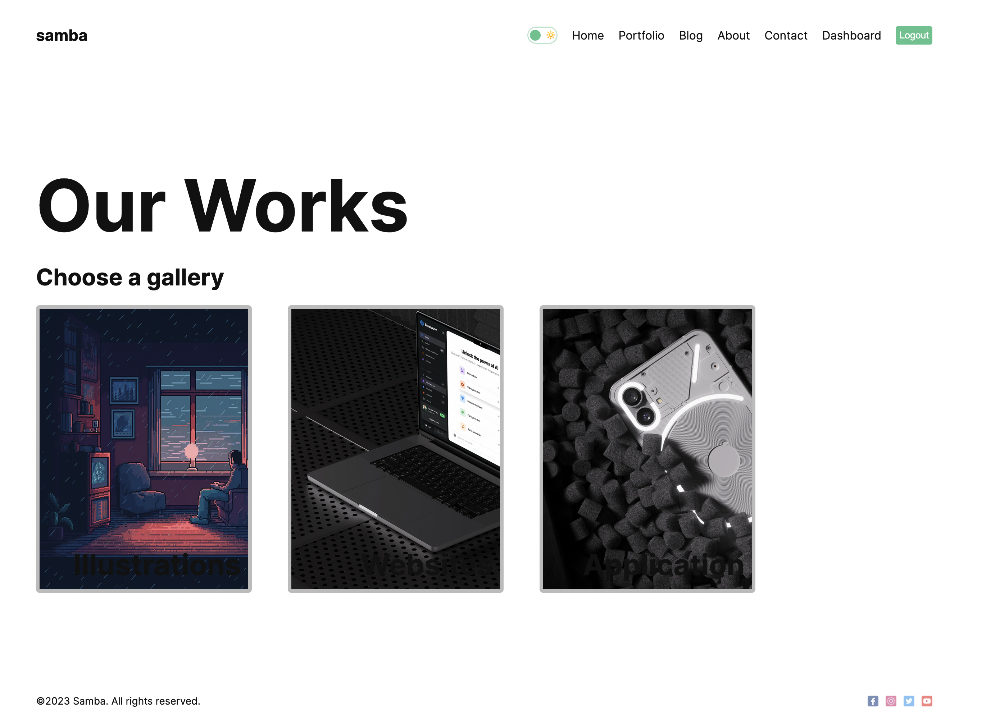
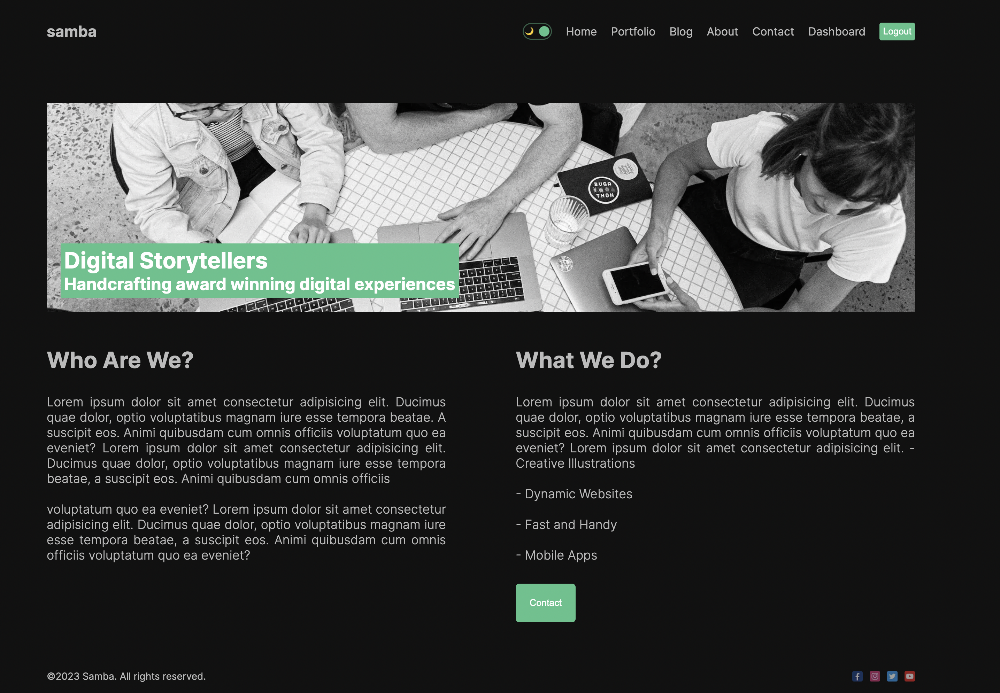
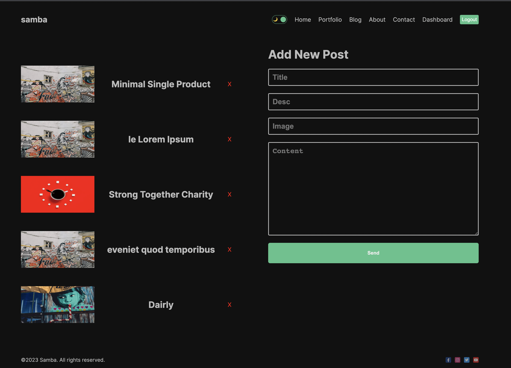
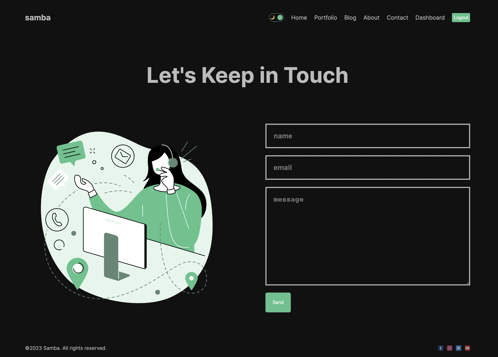

# Next.js 13 Full Stack App Using App Router

Learn Next.js in 2023. The complete Next.js Course . Create a full stack app using Next.js 13 App Router, Auth.js, MongoDB, SSR, CSR components.

For deploying our project we will be using Netlify. We will use custom CSS.

🌏 ![demo] :(https://main--iridescent-mochi-bcf961.netlify.app/)

💻 Screen shot 💻

🚚 Topics
Introduction
Next.js Crash Course (Why You Should Use Next?)
Next.js Installation
Next.js Folder Structure
Next.js Routing Tutorial (App Router)
Next.js Layouts and Components
Next.js Rendering Explained (Server side and Client side)
Next.js Styling (Global and Module CSS)
Next.js Image Explained
Next.js App UI Design
Next.js Dark/Light Mode Tutorial
Next.js Context API Tutorial (App Router)
Next.js Data Fetching Explained (Static, Dynamic)  
Next.js How to Fetch Data on the Client Side? (SWR Tutorial)
Next.js How to Fetch Data from Local Json File?
Next.js MongoDB Full Stack App Tutorial
Next.js API Folder and CRUD Operations (App Router)
Next.js SEO Tutorial (Static and Dynamic SEO)
Next.js Auth Tutorial (New App Router)
Next.js Google Auth (Sign in with Google)
Next.js Credentials Auth (Sign in with Email and Password)
Next.js Protected Routes with Auth.js
Next.js Admin Dashboard Tutorial
Next.js SWR Mutation
